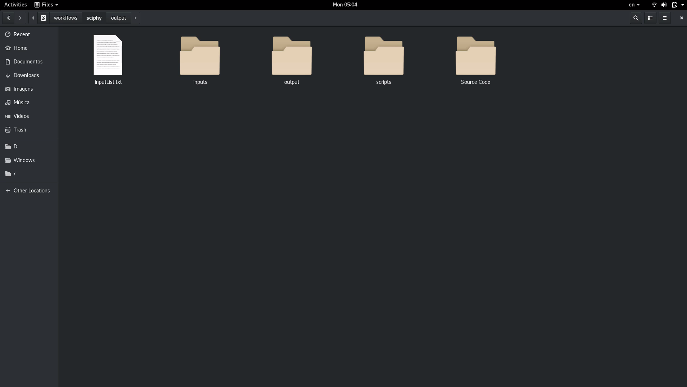

# SciSpark
>An extension of Apache Spark for scientific computational experiments

## Overview

This repository presents a quick start guide for SciSpark, an extension over Apache Spark, which aims at running black-box native programs that handle raw data files. Furthermore, this engine collects, store, and query provenance and domain-specific data that were manipulated during the execution of scientific applications. With respect to the analytical capabilities, SciSpark provides runtime dataflow analysis based on the provenance traces.

## Presentation Video

To watch the video, please, click in the image below.
<a href="https://drive.google.com/file/d/1Zb1u1vswO5GNBOHRxBelNqrEfEc5aLWY/view" target="_blank">

</a>
## Download: Docker image

We make SciSpark available for download through a [Docker](https://www.docker.com/) image. This image has all softwares requirements to run our applications using SciSpark and Apache Spark (our baseline). To download and run it, follow the steps below.

### Pull the image
To get the docker image, you need to pull it from docker hub. For this, run the command: 
```
docker pull thaylongs/sci-spark
```
### Configuration and Running the Image
After you pull the Docker image, now you can create a container from this image running the follow command:

```
docker run --rm -it \
       -p 8000:8000 -p 9042:9042 \
       -v $PWD/repository:/SciSparkFiles/SciSpark/gitblit/data/git \
       -v $PWD/database:/SciSparkFiles/datastax-ddc-3.9.0/data \
       -v $PWD:/home/scispark/workspace thaylongs/sci-spark
```

This command will share the current folder of the terminal (```$PWD:/workspace```) as the workspace of the container. So, in this folder should have the files that you want to use in your experiment, for example, source code and softwares. In our example command, inside the current directory will be created another two folders,  the ```$PWD/repository``` for save data from the git repository,  and the ```$PWD/database``` for save the database data. You can change these directories as you want. This command also opens the ports 8000 and 9042, for the web interface and the Cassandra database, respectively.

After you run the command, an bash in the workspace directory will be available for you run your codes. This container, the binary of Apache Spark and Scala already in the ```PATH``` environment variable. This environment also already has the following variables. 
- SPARK_HOME => The SciSpark root path.
- WORKSPACE  => The workspace path.
- SCI_SPARK_REPOSITORY => The VCS repository path.
- SCI_SPARK_CLASS_PATH => List of all jars of SciSpark/Spark, it is used to compile your source code. 

In this container, to compile a scala source code for create the .jar to submit to SciSpark, you run the follow command:

```
scalac -classpath "$SCI_SPARK_CLASS_PATH" SourceCode.scala -d TheOutput.jar
``` 

You also can run the scala interactive shell, with all SciSpark/Spark jars, running the follow command: 

```
scala -cp $SCI_SPARK_CLASS_PATH -J-Xmx1g
```

## Quick Start Guide

SciSpark is an extension of [Apache Spark](https://spark.apache.org/), and as such, hash all default characteristics of its baseline. In this way, most existing Spark codes, which depends only of Spark Core, are compatible with our implementation. So, in this quick start guide, we will show the only the methods that we implemented.

In the Spark, everything starts with the creation of [```SparkContext```](https://spark.apache.org/docs/2.2.1/api/java/org/apache/spark/SparkContext.html). This class is used to begin the transformation process and can receive as parameter the [```SparkConf```](https://spark.apache.org/docs/2.2.1/api/java/org/apache/spark/SparkConf.html). The ```SparkConf``` is used to configure an execution and in the Spark, and now this class has new methods:

- ```enableProvence()``` and ```disableProvence()``` : to enable e disable the provenance;
- ```enableVersionControl()``` and ```disableVersionControl()``` : to enable e disable the version control system;
- ```setScriptDir(directory: String)``` : method used to inform the SciSpark where are the script or programs that will be executed by the runScientificApplication method;

### New RDD Operations


In the Spark, we handle the data through of creates [```RDD```](https://spark.apache.org/docs/2.2.1/api/java/org/apache/spark/rdd/RDD.html), to create one, we use the ```SparkContext``` that create one from some source of data. All data dealt with by one ```RDD``` is saved in the database of provenance. If you don't want it for a specific ```RDD```, just call the ```ignoreIt()``` method. It is useful if a transformation doesn't produce a relevant data.


#### Schema

As previously stated, all data handled by one RDD is saved in the database. To improve the information that will be saved there, you can use the Schema. Utilizing Schema, you can select only the relevant data or format it. To create a Schema, you should create a class and extends the interfaces class ```DataElementSchema``` or ```SingleLineSchema``` and implemented the methods. In both classes have the method ```geFieldsNames()``` that expect as a result an array of string with all attributes of data.


* Sample of code: DataElementSchema

TODO

* Sample of code: SingleLineSchema

TODO

To assign a Schema to a RDD, you use the method ```setSchema(schema: DataElementSchema[T])``` that receive as the parameter a Schema of the type that its handle.  


* Sample of assign a Schema to a RDD

TODO

### File Group

