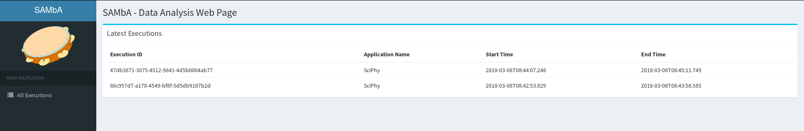

# SAMbA (Spark provenAnce MAnagement)
>An extension of Apache Spark for scientific computational experiments

## Overview

This repository presents a quick start guide for SAMbA, an extension over Apache Spark, which aims at running black-box native programs that handle raw data files. Furthermore, this engine collects, store, and query provenance and domain-specific data that were manipulated during the execution of scientific applications. With respect to the analytical capabilities, SciSpark provides runtime dataflow analysis based on the provenance traces.


## Quick Start Guide

SAMbA is an extension of [Apache Spark](https://spark.apache.org/), and as such, has all default characteristics of its baseline. In this way, most existing Spark codes, which depends only of Spark Core, are compatible with our implementation. So, in this quick start guide, we will show the only the methods that we implemented.

In the Spark, everything starts with the creation of [```SparkContext```](https://spark.apache.org/docs/2.2.1/api/java/org/apache/spark/SparkContext.html). This class is used to begin the transformation process and can receive as parameter the [```SparkConf```](https://spark.apache.org/docs/2.2.1/api/java/org/apache/spark/SparkConf.html). The ```SparkConf``` is used to configure an execution and in the Spark, and now this class has new methods:

- ```enableProvenance()``` and ```disableProvenance()``` : To enable e disable the provenance;
- ```enableVersionControl()``` and ```disableVersionControl()``` : To enable e disable the version control system;
- ```setScriptDir(directory: String)``` : Method used to inform the SAMbA where are the script or programs that will be executed by the runScientificApplication method;

By default, the provenance and the version control system are enabled.

### New RDD Operations


In the Spark, we handle the data through of creates [```RDD```](https://spark.apache.org/docs/2.2.1/api/java/org/apache/spark/rdd/RDD.html), to create one, we use the ```SparkContext``` that create one from some source of data. All data dealt with by one ```RDD``` is saved in the database of provenance. If you don't want it for a specific ```RDD```, just call the ```ignoreIt()``` method. It is useful if a transformation doesn't produce a relevant data.


#### Schema

As previously stated, all data handled by one RDD is saved in the database. To improve the information that will be saved there, you can use the Schema. Utilizing Schema, you can select only the relevant data or format it. To create a Schema, you should create a class and extends the interfaces class ```DataElementSchema[T]``` or ```SingleLineSchema[T]``` and implemented the methods. In both classes have the method ```geFieldsNames()``` that expect as a result an array of string with all attributes of data.

* Sample of code: ```SingleLineSchema``` - Use this kind of schema when the result has only one line.

```scala
import br.uff.spark.schema.SingleLineSchema

class SampleOfSingleLineSchemaOfString extends SingleLineSchema[String] {

  override def geFieldsNames(): Array[String] = Array("Att 1", "Att 2")

  //value = "Value 1;Value 2"
  override def splitData(line: String): Array[String] = {
    val data = line.split(";")
    Array(data(0), data(2))
  }
}
```

* Sample of code: ```DataElementSchema``` - Use this kind of schema when the result has more then one line.

```scala
import br.uff.spark.schema.DataElementSchema

class SampleOfMultiLineSchemaOfString extends DataElementSchema[String]{

  override def geFieldsNames(): Array[String] = Array("Att 1", "Att 2")

  //value = "Line 1 Value 1;Line 1 Value 2;Line 2 Value 1;Line 2 Value 2"
  override def getSplitedData(value: String): Array[Array[String]] = {
  val data = value.split(";")
    Array(
      Array(data(0), data(1)),
      Array(data(2), data(3))
    )
  }
}
```

To assign a Schema to a RDD, you use the method ```setSchema(schema: DataElementSchema[T])``` that receive as the parameter a Schema of the type that its handle.  


* Sample of assign a Schema to a RDD

```scala
   sparkContext.parallelize(
      Array(
        "Value 1;Value 2",
        "Value 3;Value 4",
        "Value 5;Value 6"
      )
    ).setSchema(new SampleOfSingleLineSchemaOfString())
```

If you don't inform a Scheme to an RDD, a default one will be used, which change according to the type. 

### Black-box application support

The main feature of SAMbA, besides the provenance manage, is the possibility the run black-box application which handles files with the Spark. To do it, we create an abstraction called ```FileGroup```. A ```FileGroup``` is a feature which allows the users load data stored in a set of files into an in-memory filesystem. To load a set of files into memory, we use a new method of ```SparkContext``` the ```fileGroup```. This method receives as the parameter a ```varargs``` of ```FileGroupTemplate```.


This ```FileGroupTemplate``` can be created with helpers methods:
 * To Load Files: You use one of following methods:

```scala
import br.uff.spark.advancedpipe.FileGroupTemplate
import java.io.File

//To load just one file, you can use this method
FileGroupTemplate.ofFile(
                  file:File, // The File
                  keepBaseDir: Boolean, //If Keep the parent directory of File
                  extraArgs: Map[String, Any] // Extra Information
           ): FileGroupTemplate

//To load more than one, you can use this method
FileGroupTemplate.ofFiles(
                  dir: File, //Parent directory 
                  files: scala.List[String], // The lists of files which are inside of this folder
                  extraArgs: Map[String, Any] // Extra Information
          ): FileGroupTemplate

```
> But, what means keep base directory?

As previously stated, a FileGroup represents a set of files. This file in memory also can be structured in folders. For example, consider the file:  ```/home/user/somefile.txt```, if you keep the base directory, in the ```FileGroup``` this file will be in the same path, but, if not, this file will be in the root path of ```FileGroup```.


* To Load all files of a folder: 

```scala
import br.uff.spark.advancedpipe.FileGroupTemplate
import java.io.File
import java.nio.file.Path
import java.util.function.Predicate

//To load all files of folder
FileGroupTemplate.ofDirectory(
                dir: File, // The folder directory
                isRecursive: Boolean, //If is to add  the files recursively
                extraArgs: Map[String, Any] // Extra Information
          ): FileGroupTemplate

//The same method above, but now you can apply a filter function to add, or not, a file in the FileGroup
FileGroupTemplate.ofDirectoryWithFilter(
                dir: File, // The folder directory
                isRecursive: Boolean, //If is to add the files recursively
                testFile: Predicate[Path], // The Filter function
                extraArgs: Map[String, Any] // Extra Information
          ): FileGroupTemplate

//An example of use the FileGroupTemplate.ofDirectoryWithFilter
   FileGroupTemplate.ofDirectoryWithFilter(
      new File("/someFolder"),
      false,
      new Predicate[Path] {
        override def test(t: Path): Boolean = true // true for all files
      },
      Map()
    )

```
* If one of these methods don't resolve your problem, you can also instantiate a FileGroupTemplate
```scala
import br.uff.spark.advancedpipe.FileGroupTemplate

new FileGroupTemplate(
         baseDir: File, // Parent directory. If it's null, it's mean to keep base directory of files 
         files: scala.List[File], // The list of files to be loaded into memory, if the baseDir != null, these files must be inside there.
         extrasInfo: Map[String, Any] // Extra Information
     ): FileGroupTemplate

```
When you instantiate a FileGroupTemplate, if you inform the ```baseDir```, this means that all files to load must be inside there. It also means that this folder, in the FileGroup, will be the new root path. 


* An example of how to instantiate a FileGroupTemplate

```scala
import br.uff.spark.advancedpipe.FileGroupTemplate
import java.io.File

// The implementation of FileGroupTemplate.ofFile method 
def ofFile(_file: File, keepBaseDir: Boolean, extraArgs: Map[String, Any]): FileGroupTemplate = {
  val file = _file.getAbsoluteFile
  var baseDir = file.getParentFile
  if (keepBaseDir) baseDir = null
  new FileGroupTemplate(baseDir, List(file), extraArgs)
}

```

The ```FileGroupTemplate``` also has an optional attribute, its name. It can be setted by ```setName(newName: String)``` method .  In the version control, this name is used to identify the ```FileGroup``` that it represents.

### How execute a black-box program.

The method ```fileGroup``` of ```SparkContext```, return a ```RDD[FileGroup]```. This kind of RDD has two new methods to run a native program, being them:

-  ```runScientificApplication( ... ):RDD[FileGroup]```
-  ```runCommand( ... ): RDD[FileGroup]```

#### When use the: ```runScientificApplication```
This method is used to run program/script that is in directory folder informed in Spark configuration with ```setScriptDir```. This method receives as a parameter the command to execute, as its respective arguments. Besides, this method also has a template engine that is used to insert map information from the ```FileGroup```. More information about the template engine can be found [here](http://jtwig.org/documentation/quick-start/application). The source code below is an example of use this method.

```scala 
val sparkContext = new SparkContext(
  new SparkConf().setAppName("Example Black-box application")
    .setScriptDir("/home/user/dataflow/scripts/")
    .setMaster("local[4]")
)
sparkContext.fileGroup(
  FileGroupTemplate.ofFile(
      new File("/home/user/dataflow/somefile.txt"),
      false, Map("FILE_NAME" -> "somefile.txt")
  )
  /* /home/user/dataflow/scripts/someScript.sh */ 
).runScientificApplication("someScript.sh {{FILE_NAME}}")
```

#### When use the: ```runCommand```
If your programs aren't in the folder which was informed in ```setScriptDir```, or if you need more option, you can use the ```runCommand``` method. This method has two overloads.

* A very simple:

```scala
someRDD.runCommand(cmd:Seq[String]): RDD[FileGroup] 
//Example
someRDD.runCommand(Array("ls","-a") 
```

* A more complex:

```scala 
import import br.uff.spark.advancedpipe.{ExecutionPlanning, FileElement}

//function - a function that consumes the extra info provided by FileGroup and return a ExecutionPlanning
def runCommand(function: (
                  Map[String, Any], // The extra information map
                  scala.Seq[FileElement] // The list of files of FileGroup that it will execute over
                 ) => ExecutionPlanning
         ): RDD[FileGroup]

//The code of ExecutionPlanning. Only the command to run is required
class ExecutionPlanning(
    val command: Seq[String],
    val env: Map[String, String] = Map(),
    val redirectErrorStream: Boolean = false,
    val encoding: String = "UTF-8"){

  var onReadLine: (String) => Unit = line => logInfo(line)
  var onReadErrorLine: (String) => Unit = errorLine => logError("Error stream line: " + errorLine)

  var filterFilesForGeneratedRDD: (FileElement) => Boolean = (_) => true
  var getExtrasInfoForGeneratedRDD: () => Map[String, AnyRef] = null
}

//Example
someRDD.runCommand{(extraInfo: Map[String, Any], fileElements: Seq[FileElement])=>
      val executionPlanning= new ExecutionPlanning(Array("ls","-a"))
      executionPlanning.onReadLine = (line)=>{
        println(s"Output of ls command: $line")
      }
      executionPlanning      
    }

```
### FileGroup Attributes 
The ```FileGroup``` has the following code:

```java 
public class FileGroup implements Serializable {

    private String name = null; //The Name of FileGroup
    private Map<String, Object> extraInfo; // The map if extra information
    private FileElement[] fileElements; // A array of files that it represents. 
  ....
}
```

To read a file, you need access the fileElements and find what file you want. A ```FileElement``` has the following methods to get its attributes:

- ```getFileName():String``` - The File name
- ```getFilePath():String``` - The File Path
- ```getFileSize():String``` - The File Size
- ```getContents().toInputStream(): java.io.InputStream``` - Create a InputStream

### Saving FileGroup in Disk
A ```RDD[FileGroup]``` also has two methods to save the data that it represents on disk: 

- ```saveFilesAt(directory: java.io.File)``` - save the data inside the directory. For each FileGroup, is create another directory with its ID.

- ```saveFilesAtAsync(directory: java.io.File): org.apache.spark.FutureAction``` - do the same thing of ```saveFilesAt``` but now non-blocking way.

## Web Interface

Another important feature provided by SAMbA is a web interface. This interface is accessed through the browser on localhost on port 8000. In this web interface, you will found information about the execution that already executed, such the transformation graph or the data elements which was generated and used by it. To see this web interface in action, with an explanation of all its feature, please, watch the demonstration video. 



## Version Control System
SAMbA also provides to your users a version control system. When you create a ```FileGroup``` through call the ```fileGroup``` method of ```SparkContext``` or run a black-box application, the ```FileGroup``` that its represents will be saved in this repository. All another Spark operation, this need be explicit, calling the method: ```persistFileGroupInGit() : RDD```. The git bare repository can be accessed by the user, the full path is available in environment variable SCI_SPARK_REPOSITORY.

## Example

You can found a list with examples on [here](examples/README.md).

## Download: Docker image

We make SAMbA available for download through a [Docker](https://www.docker.com/) image. This image has all softwares requirements to run our applications using SAMbA and Apache Spark (our baseline). To download and run it, follow the steps below.

### Pull the image
To get the docker image, you need to pull it from docker hub. For this, run the command: 
```bash
docker pull thaylongs/sci-spark
```
### Configuration and Running the Image
After you pull the Docker image, now you can create a container from this image running the follow command:

```bash
docker run --cap-add mknod --cap-add sys_admin --device=/dev/fuse  \
       --privileged --rm -it -p 8000:8000 -p 9042:9042 \
       -v $PWD/repository:/SciSparkFiles/SciSpark/gitblit/data/git \
       -v $PWD/database:/SciSparkFiles/datastax-ddc-3.9.0/data \
       -v $PWD:/home/scispark/workspace thaylongs/sci-spark
```

This command will share the current folder of the terminal (```$PWD:/workspace```) as the workspace of the container. So, in this folder should have the files that you want to use in your experiment, for example, source code and softwares. In our example command, inside the current directory will be created another two folders,  the ```$PWD/repository``` for save data from the git repository,  and the ```$PWD/database``` for save the database data. You can change these directories as you want. This command also opens the ports 8000 and 9042, for the web interface and the Cassandra database, respectively.

After you run the command, an bash in the workspace directory will be available for you run your codes. This container, the binary of Apache Spark and Scala already in the ```PATH``` environment variable. This environment also already has the following variables. 
- SPARK_HOME => The SAMbA root path.
- WORKSPACE  => The workspace path.
- SCI_SPARK_REPOSITORY => The VCS repository path.
- SCI_SPARK_CLASS_PATH => List of all jars of SciSpark/Spark, it is used to compile your source code. 

In this container, to compile a scala source code for create the .jar to submit to SciSpark, you run the follow command:

```bash
scalac -classpath "$SCI_SPARK_CLASS_PATH" SourceCode.scala -d TheOutput.jar
``` 

You also can run the scala interactive shell, with all SciSpark/Spark jars, running the follow command: 

```bash
scala -cp $SCI_SPARK_CLASS_PATH -J-Xmx1g
```

## Presentation Video

To watch the video, please, click in the image below.
<a href="https://drive.google.com/file/d/1st1dRJCGyTLNEVjZp5i-nnLjJkVjMNKZ/view" target="_blank">

</a>
