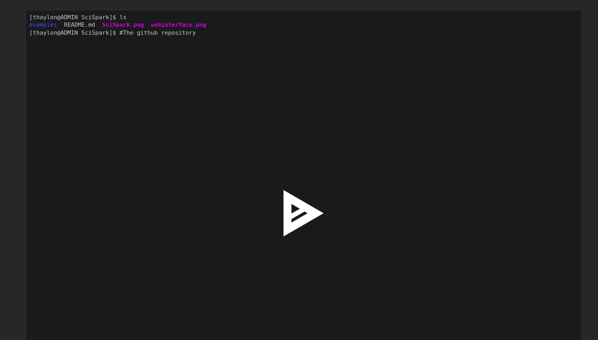

# SciPhy Example

This directory has all files that you need to run the example that we shown in the demonstration video. To  run it, open a Docker container in this current folder. For this, run the following command:

```bash
docker run --cap-add mknod --cap-add sys_admin --device=/dev/fuse  \
       --privileged --rm -it -p 8000:8000 -p 9042:9042 \
       -v "$PWD/repository:/SAMbAFiles/SAMbA/gitblit/data/git" \
       -v "$PWD/database:/SAMbAFiles/apache-cassandra/data" \
       -v "$PWD:/home/samba/workspace" thaylongs/samba
```

After the container boot, go to "Source Code" directory and run the following commands:

```bash
cd "Source Code"
sh build.sh
sh submit.sh
```

If you want to change the inputs, you can change it in the ```submit.sh``` bash script adding the top  of file  command like:

``` bash
echo "FILE_NAME;$WORKSPACE/inputs/FILE_NAME" >> inputList.txt
```

Where the ```FILE_NAME``` is the file name of the file that you want to add. You can found all files in the ```inputs/``` folder. 

## An session Recorded

The video below shows the sequence of commands that you needs to do to execute the example:

<a href="https://asciinema.org/a/Qzg1SV1JhJlLHjlTpAzVIUviU" target="_blank">




</a>


